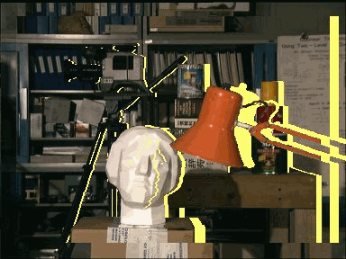
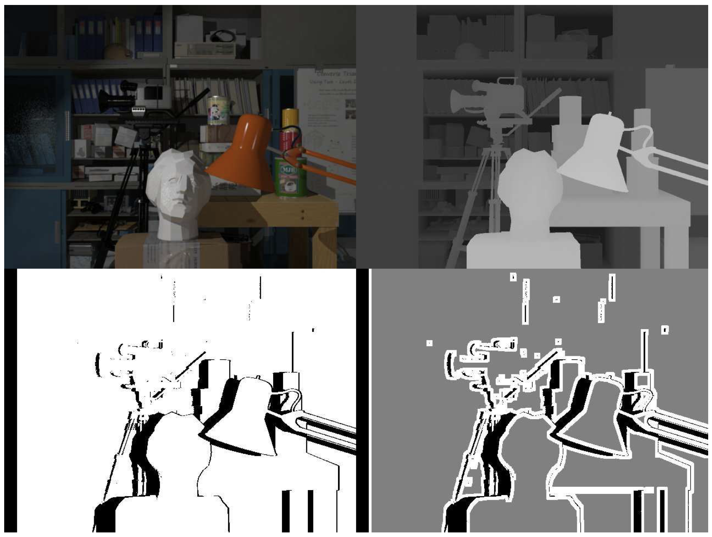
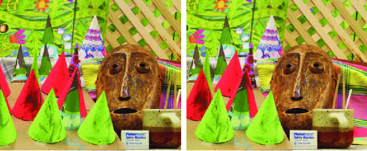
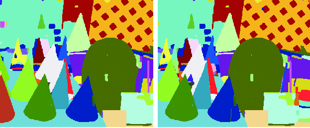
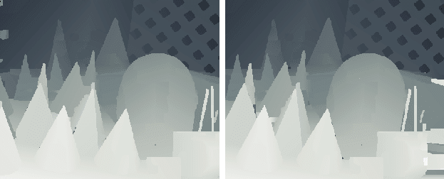

# **Stereo Depth Estimation**  
🔹 **Estimating depth from stereo image pairs using deep learning.**  

<p align="center">
  
</p>

---

## 🧐 **What is Stereo Depth Estimation?**  
**Stereo depth estimation** is a technique used to infer **depth information** from two images captured from **slightly different perspectives** (left and right views). It is widely used in:  
- **Autonomous Vehicles** 🚗 (for object detection and obstacle avoidance)  
- **Robotics** 🤖 (for 3D mapping and navigation)  
- **Augmented Reality (AR) & Virtual Reality (VR)** 🎮  
- **Medical Imaging** 🏥 (for 3D reconstruction of organs)  

The process involves **computing a disparity map**, which measures the pixel shift between left and right images. The greater the disparity, the closer the object is to the camera.

<p align="center">
  
</p>

---

## 🎯 **What Will You Do?**  
We have already **trained a deep neural network** for stereo depth estimation. This model takes **two images** (left and right) and predicts a **disparity map**, which can be converted into depth information.

🚀 **Your task**:  
✅ **Run the provided script** and visualize the **stereo depth estimation results**.  
✅ **Modify and experiment** with the network to improve its accuracy.  
✅ **Explore the impact of different datasets and models** on performance.

---

## ▶️ **How to Run**  

### **🔧 Setup Instructions**  
To run the stereo depth estimation model, follow these steps:

- ### 1️⃣ **Clone the Repository**
```bash
git clone git@github.com:JamunaSMurthy/Stereo-Depth-Estimation.git
```
- 2️⃣ Navigate to the Project Directory
```bash
cd Stereo-Depth-Estimation
```
- 3️⃣ Install the Required Dependencies
```bash
pip install -r requirements.txt
```
- 4️⃣ Run the Stereo Depth Estimation Script
```bash
python test.py
```
- 5️⃣ View the Results
- The script will output disparity maps that show depth estimation for different stereo image pairs.

---

🖼 Example Outputs

Here are sample outputs of the stereo depth estimation model:

1️⃣ Input Stereo Image Pair
<p align="center"> 
     
</p>
2️⃣ Generated Disparity Map
<p align="center"> 
     
</p>

- ✅ Brighter areas indicate objects closer to the camera.
- ✅ Darker areas represent objects farther away.

---

## 🔬 Understanding the Model

This implementation is inspired by deep learning-based stereo depth estimation models like:

- PSMNet - A pyramid stereo matching network.
- RAFT-Stereo - A recurrent all-pairs field transformer for stereo depth estimation.

## Our model works by:

- Extracting features from the left and right images.
- Matching corresponding points in both images.
- Computing a disparity map, which is converted into depth.
<p align="center">  </p>

---
## 🔮 Future Enhancements

🚀 Planned Improvements:

- ✔️ Integration with neural radiance fields (NeRF) for improved depth accuracy.
- ✔️ Optimized inference speed for real-time applications.

---
## 📜 Acknowledgment

This implementation is based on:

- 1. PSMNet - A powerful stereo matching model.
- 2. RAFT-Stereo - A state-of-the-art deep learning approach.

## 👨‍💻 Contributors
- @JamunaSMurthy
- 🚀 Feel free to contribute to this repository by submitting issues or pull requests!

## ⭐ Support & Feedback

- If you find this project useful, please ⭐ star this repository and share your feedback!

